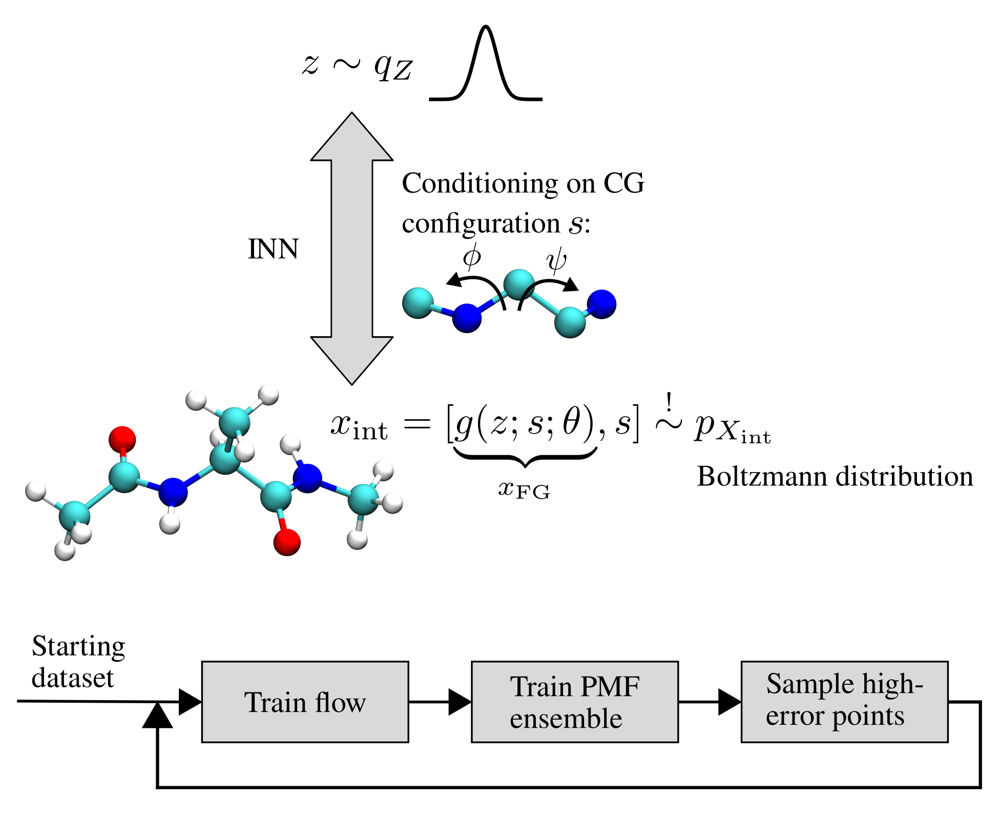

# Conditional normalizing flows for active learning of coarse-grained molecular representations

*Code for the paper [Conditional Normalizing Flows for Active Learning of Coarse-Grained Molecular Representations
](https://arxiv.org/abs/2402.01195) (ICML 2024)*

This repository contains our implementation to use active learning to efficiently sample the CG space of molecular systems.
This is enabled by a conditional normalizing flow that allows obtaining the free energy labels in the CG space.

All code to reproduce the experiments in our publication is provided.

<p align="center">

</p>

## Requirements

An environment with all dependencies can be installed in the following way (run commands from within the root directory of the repository):

```bash
conda env create -f environment.yaml
```

Since we use [weights and biases](https://wandb.ai/) to track experiments, you first need 
to login to your account:

```bash
wandb login
```

Furthermore, we calculate forward KLD metrics for alanine dipeptide to compare with a ground truth MD dataset.
We use the dataset provided by [Midgley et al.](https://arxiv.org/abs/2208.01893) available
at [Zenodo](https://zenodo.org/records/6993124#.YvpugVpBy5M).
Download the file `test.pt`, place it in `./main/systems/aldp/datasets/`, and run the following
command within the directory `./main/systems/aldp/datasets/` (requires at least ~32 GB RAM):

```bash
python convert_aldp_dataset.py
```

## Running the experiments

`.main/configs/` contains the three kinds of configurations for the experiments in the paper.
The configuration options are explained directly in the config files, details can be found in our publication.
The experiments can be started in the following way (run commands from within `./main/`):

```bash
conda activate coarse_graining

python train.py --config ./configs/selected_config.yaml
```

The PMF after each iteration (or every 10 epochs for the grid conditioning experiments) along with 
the KLD and other metrics are all logged to wandb.